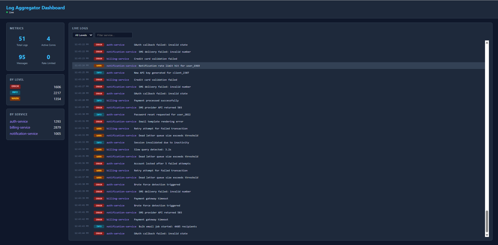

# Real-Time Log Aggregation Service

A distributed real-time log aggregation system built from scratch using Python's `asyncio`, custom TCP protocol, SSL/TLS encryption, and a live web dashboard.

## Architecture

```
┌─────────────────────────────────────────────────────────────────────┐
│                          NETWORK (SSL/TLS)                         │
│                                                                     │
│  ┌──────────────┐         ┌──────────────────────────────────────┐  │
│  │   Producer    │────TCP──│           Async TCP Server           │  │
│  │              │         │                                      │  │
│  │ • Auth token  │         │  ┌────────────────────────────────┐  │  │
│  │ • Heartbeats  │         │  │  Authentication (Token-based)  │  │  │
│  │ • Send logs   │         │  ├────────────────────────────────┤  │  │
│  └──────────────┘         │  │  Rate Limiter (Token Bucket)   │  │  │
│                           │  ├────────────────────────────────┤  │  │
│  ┌──────────────┐         │  │  Heartbeat Monitor             │  │  │
│  │   Consumer    │────TCP──│  ├────────────────────────────────┤  │  │
│  │              │         │  │  Pub/Sub Router                │  │  │
│  │ • Auth token  │         │  │  (service - consumers)        │  │  │
│  │ • Heartbeats  │         │  └───────────┬────────────────────┘  │  │
│  │ • Recv logs   │         │              │                      │  │
│  └──────────────┘         └──────────────┼───────────────────────┘  │
│                                          │                         │
│                              ┌───────────┴───────────┐             │
│                              │                       │             │
│                     ┌────────▼──────┐    ┌───────────▼──────────┐  │
│                     │   SQLite DB   │    │  Web Dashboard :8080 │  │
│                     │               │    │                      │  │
│                     │ • Log storage │    │  • REST API          │  │
│                     │ • Query/filter│    │  • WebSocket (live)  │  │
│                     │ • Statistics  │    │  • Metrics & filters │  │
│                     └───────────────┘    └──────────────────────┘  │
│                                                                     │
└─────────────────────────────────────────────────────────────────────┘
```

## Features

| Feature | Description |
|---|---|
| **Async I/O** | Built entirely on `asyncio` — no threads, fully non-blocking |
| **Custom Wire Protocol** | Length-prefixed JSON framing over TCP (4-byte big-endian header) |
| **SSL/TLS Encryption** | All TCP traffic encrypted with self-signed certificates |
| **Token Authentication** | Clients must authenticate before sending/receiving data |
| **Pub/Sub Architecture** | Producers publish logs - Server routes - Consumers receive |
| **SQLite Persistence** | All logs stored in SQLite; survive server restarts |
| **Rate Limiting** | Token-bucket algorithm (20 msgs / 10 sec per client) |
| **Heartbeat Monitoring** | Clients send heartbeats every 5s; server removes dead clients after 15s |
| **Live Dashboard** | Real-time web UI with WebSocket streaming, REST API, filters |
| **Server Metrics** | Tracks connections, messages, auth failures, rate limits |
| **Docker Support** | Full `docker-compose` setup for multi-container deployment |

## Project Structure

```
socket_tuts/
├── server.py            # Main async TCP server (entry point)
├── producer.py          # Log producer client
├── consumer.py          # Log consumer client
├── protocol.py          # Wire protocol (sync + async encode/decode)
├── database.py          # SQLite persistence layer
├── dashboard.py         # REST API + WebSocket + HTML dashboard
├── tests.py             # 16 unit tests
├── requirements.txt     # Python dependencies
├── Dockerfile           # Container build
├── docker-compose.yml   # Multi-service orchestration
├── server.crt           # SSL certificate (self-signed)
├── server.key           # SSL private key
└── README.md
```

## Getting Started

### Prerequisites

- Python 3.8+
- pip

### Installation

```bash
git clone https://github.com/<your-username>/log-aggregator.git
cd log-aggregator
pip install -r requirements.txt
```

### Generate SSL Certificates (if not present)

```bash
openssl req -x509 -newkey rsa:2048 -keyout server.key -out server.crt -days 365 -nodes -subj "/CN=localhost"
```

Or with Python:

```python
python -c "
from cryptography import x509
from cryptography.x509.oid import NameOID
from cryptography.hazmat.primitives import hashes, serialization
from cryptography.hazmat.primitives.asymmetric import rsa
import datetime, ipaddress

key = rsa.generate_private_key(65537, 2048)
name = x509.Name([x509.NameAttribute(NameOID.COMMON_NAME, 'localhost')])
cert = (x509.CertificateBuilder()
    .subject_name(name).issuer_name(name).public_key(key.public_key())
    .serial_number(x509.random_serial_number())
    .not_valid_before(datetime.datetime.utcnow())
    .not_valid_after(datetime.datetime.utcnow() + datetime.timedelta(days=365))
    .add_extension(x509.SubjectAlternativeName([
        x509.DNSName('localhost'),
        x509.IPAddress(ipaddress.IPv4Address('127.0.0.1'))
    ]), critical=False)
    .sign(key, hashes.SHA256()))
open('server.key','wb').write(key.private_bytes(serialization.Encoding.PEM, serialization.PrivateFormat.TraditionalOpenSSL, serialization.NoEncryption()))
open('server.crt','wb').write(cert.public_bytes(serialization.Encoding.PEM))
print('Done')
"
```

### Run Locally

Open 3 terminals:

```bash
# Terminal 1 — Server + Dashboard
python server.py

# Terminal 2 — Producer
python producer.py

# Terminal 3 — Consumer
python consumer.py
```

Then open **http://localhost:8080** for the live dashboard.

### Run with Docker

```bash
docker compose up --build
```

Dashboard available at **http://localhost:8080**.

## Running Tests

```bash
python -m unittest tests -v
```

## API Endpoints

| Method | Endpoint | Description |
|---|---|---|
| `GET` | `/` | Live dashboard UI |
| `GET` | `/api/logs?service=X&level=Y&limit=N` | Query stored logs |
| `GET` | `/api/stats` | Server metrics + DB statistics |
| `WS` | `/ws` | WebSocket stream of live logs |

## Wire Protocol

Messages use a **length-prefixed JSON** format:

```
┌──────────────┬──────────────────────────────┐
│ 4 bytes (BE) │  JSON payload (UTF-8)        │
│  msg length  │  {"type": "log", ...}        │
└──────────────┴──────────────────────────────┘
```

### Message Types

| Type | Direction | Purpose |
|---|---|---|
| `auth` | Client - Server | Send authentication token |
| `auth_success` | Server - Client | Token accepted |
| `auth_failed` | Server - Client | Token rejected, connection closed |
| `register` | Client - Server | Register as producer or consumer |
| `log` | Producer - Server - Consumers | Log event |
| `heartbeat` | Client - Server | Keep-alive ping |
| `heartbeat_ack` | Server - Client | Keep-alive response |
| `error` | Server - Client | Error message (auth required, rate limit, etc.) |

## Dashboard Screenshot



*Real-time log viewer with level/service filters, live WebSocket connection, and server metrics.*

## Tech Stack

- **Python 3.8+** — asyncio, ssl, struct, json
- **aiohttp** — HTTP server + WebSocket
- **aiosqlite** — Async SQLite wrapper
- **Docker** — Containerization

## License

MIT
